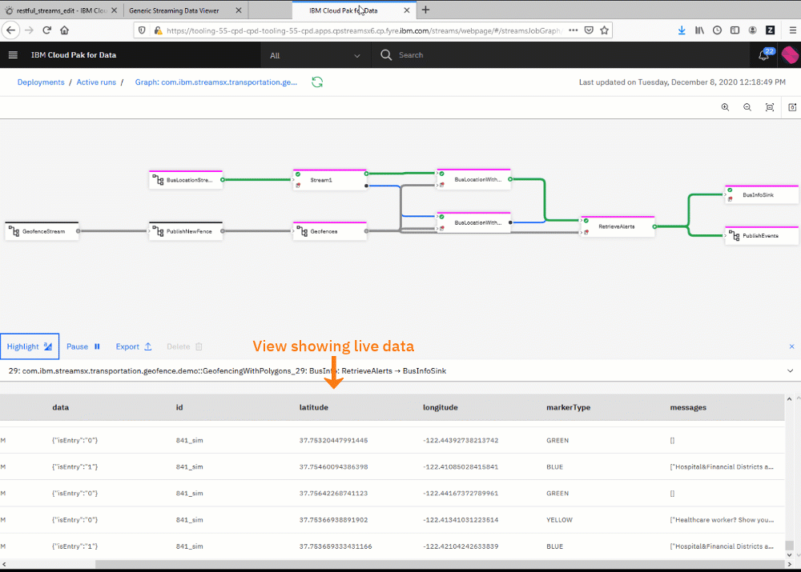

# Streams REST Data Viewer Application

This is a demo Python web app that displays streaming data from any Streams job running as a service in Cloud Pak for Data. Tuples sent to the `EndpointSink` operator are continuously retreived and updated in a table.

See [this blog post](https://ibm.biz/streams-job-service) for details about the Streams jobs as a service feature.


This app is a way to quickly view data from any Streams job that uses the `EndpointSink` operator. All you need are the Cloud Pak for Data credentials and the URL for the endpoint. 

## Features

 -  Automatically renders data containing latitude/longitude as a map

_App displaying data from a Streams application_



## Run locally:

Install requirements: ` pip install -r requirements.txt`

Run Locally: 

1. Start the server: `python wsgi.py`
2. Go to `http://127.0.0.1:5000/tables` in your browser.
3. Enter the Streams endpoint URL and the credentials and click *Submit.*
4. Data should start flowing and the table should be updated every 5 seconds. Change update [frequency here](https://github.com/natashadsilva/streams-rest-viewer/blob/master/public/table.html#L97)


Notes:

- Changes made to the client code (HTML/JS) are refreshed without restarting the server
- To retreive data from a new URL, reload the page or open a new tab. 
- If you get an error popup from DataTables, reload the page.

## Deploy to OpenShift:


```
oc new-app https://github.com/natashadsilva/streams-rest-viewer.git --name streamsdemo

oc create route edge  --service=streamsdemo


```


Show The app's route:

`oc get route streamsdemo`

Will print something like:

```
NAME           HOST/PORT                                                 PATH   SERVICES       PORT       TERMINATION   WILDCARD
streamsdemo    streamsdemo-mynamespace.apps.cpstreamsx2.cp.host.com               streamsdemo     8080-tcp                   None

```

Open the URl under `https://<url>` using the URL under the HOST/PORT column.  


### Making changes

After editing, push to GitHub.

Use `oc start-build streamsdemo` to pull the latest code.

